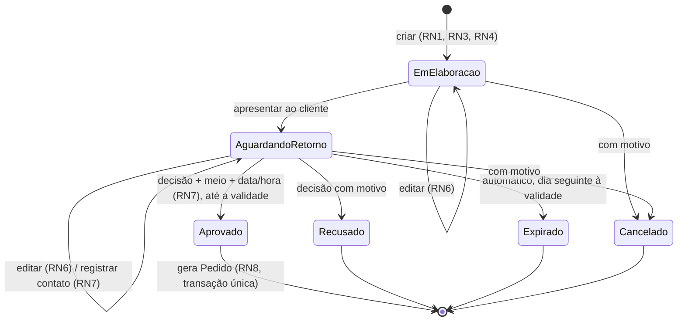
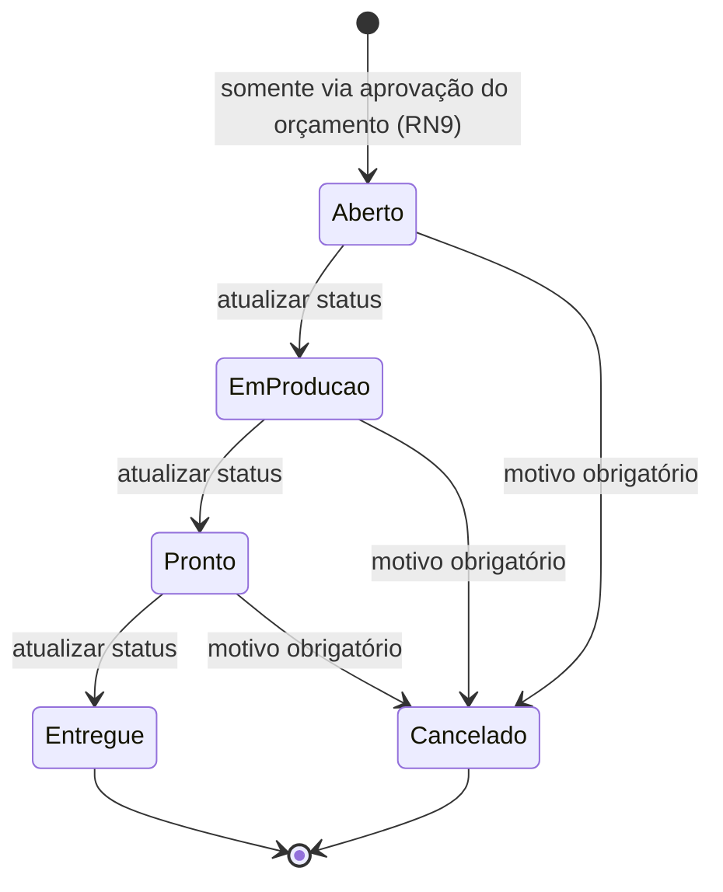
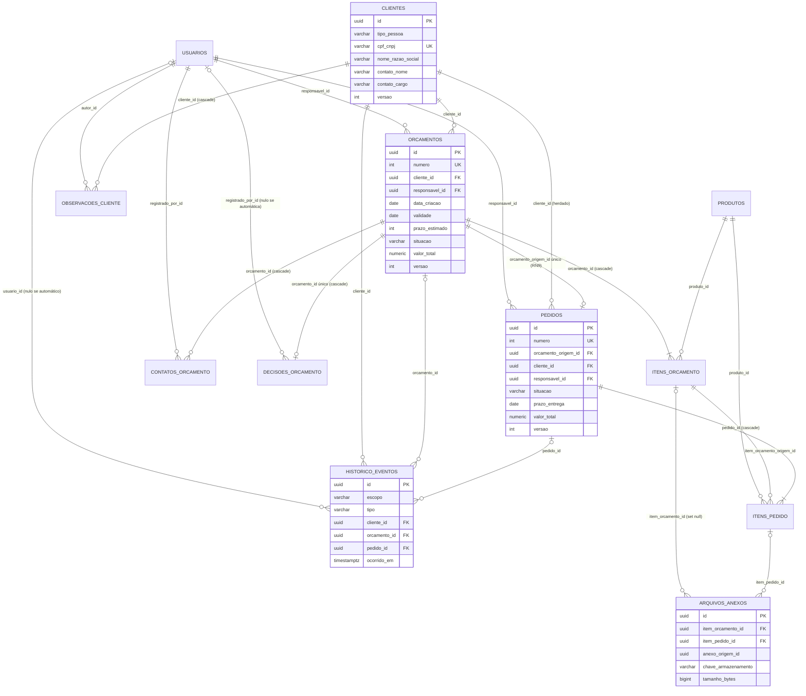

# 07 — Insumos para atualizar diagramas, DER e dicionário de dados

Lista do que muda no **Documento do Projeto** para que ele descreva o sistema entregue. Os diagramas estão em Mermaid; podem ser colados em ferramentas que o renderizam (GitHub, Notion, draw.io via plugin, mermaid.live) ou usados como referência para redesenhar.

---

## 1. Requisitos funcionais (seção 4.1)

| Requisito | Texto atual | Texto sugerido |
|---|---|---|
| RF 4.1.2.5 | "Em Elaboração → Enviado ao Cliente → Aprovado / Recusado / Expirado" | "Em Elaboração → Aguardando Retorno → Aprovado / Recusado / Expirado; cancelamento possível em Em Elaboração ou Aguardando Retorno" |
| RF 4.1.2.6 | "…enquanto sua situação for Em Elaboração ou Enviado ao Cliente" | "…Em Elaboração ou Aguardando Retorno" |
| RF 4.1.2.8 | Citado no dicionário (`meio_contato`, `data_hora` da decisão), mas **não existe** na seção 4.1 | Criar: "O sistema deve permitir registrar os contatos feitos com o cliente e a decisão comunicada, sempre com meio de contato e data/hora; registrar contato não altera a situação do orçamento" |
| RF 4.1.3.2 | Frase de exceção incompleta: "Em exceção para produtos que já estão prontos para venda e não tem especificação" | MVP 1: remover a exceção ("todo pedido nasce de orçamento aprovado"). Se a venda de pronta-entrega for necessária, descrevê-la como requisito do MVP 2, com fluxo próprio |
| RF 4.1.3.3 | "O Pedido criado deve iniciar com a situação Registrado. O avanço… depende das integrações… MVP 2" | "O pedido inicia como Aberto. No MVP 1, o atendente atualiza a situação (Aberto → Em produção → Pronto → Entregue), uma etapa por vez; a partir do MVP 2 as transições podem ser disparadas pela Ordem de Serviço" |
| RF 4.1.4.2 | "Em Elaboração, Enviado, Aprovado, Recusado, Expirado" | "Em Elaboração, Aguardando Retorno, Aprovado, Recusado, Expirado, Cancelado; e pedidos em andamento e concluídos no mês" |

## 2. Regras de negócio: numeração única

Hoje a mesma regra tem números diferentes na seção 7, no UC03 e no diagrama de classes. Sugestão: usar esta numeração em todo o documento (é a usada no código e nos testes).

| Nova | Regra | Seção 7 | UCs | Diagrama de classes |
|---|---|---|---|---|
| RN1 | Cliente cadastrado antes do orçamento | RN1 | — | — |
| RN2 | CPF/CNPJ válido e único | RN2 | RN2 (UC01) | RN2 |
| RN3 | Ao menos um item com especificação | RN3 | RN3 (UC02) | — |
| RN4 | Totais calculados automaticamente | RN4 | RN4 (UC02) | RN4 |
| RN5 | Situações do orçamento | RN5 | RN5 (UC03) | — |
| RN6 | Edição só em Em Elaboração / Aguardando Retorno | **RN7** | RN6 (UC03) | RN6 |
| RN7 | Decisão manual com meio de contato e data/hora | — | RN7 (UC03) | **RN10** |
| RN8 | Aprovação converte em pedido | RN8 | — | **RN7** (`gerarPedido`) |
| RN9 | Sem criação direta de pedido | RN9 | RN9 (UC04) | RN9 |
| RN10 | Nada é excluído, só cancelado | RN10 | — | — |

A RN6 atual da seção 7 ("Enviado pode ser Aprovado, Recusado ou Expirado") passa a fazer parte da RN5.

## 3. Casos de uso (seção 8)

- **UC01:** manter o fluxo. Acrescentar ao passo 1: "Atendente pesquisa o cliente pelo nome, CPF/CNPJ ou telefone antes de cadastrar". Acrescentar os campos "contato responsável" e "cargo".
- **UC02:** acrescentar "Atendente pode anexar arquivos de arte (PDF, PNG, JPG, AI, CDR, até 20 MB) a cada item".
- **UC03:**
  - trocar a condição de entrada "Atendente aciona **Exportar Orçamento**" por "Atendente aciona **Apresentar ao cliente**, após enviar a proposta fora do sistema";
  - no passo 1, trocar "Enviado ao Cliente" por "Aguardando Retorno";
  - novo passo 2a: "Atendente registra cada contato (meio, data/hora, conversa) sem alterar a situação";
  - novo fluxo alternativo A4: "Cancelamento com motivo";
  - na confirmação da aprovação, mostrar o resumo do que será copiado para o pedido.
- **UC04:**
  - trocar a RN9 "tendo opção de pedido sem orçamento" por "Pedido existe somente a partir de orçamento aprovado";
  - preencher o fluxo alternativo, hoje vazio: "A1. Falha na geração do pedido → nada é gravado; o orçamento permanece Aguardando Retorno e o atendente pode tentar novamente";
  - acrescentar ao passo 2 "…e os arquivos de arte".
- **UC05:**
  - remover **Cliente** dos atores: o cliente não acessa o sistema;
  - acrescentar "linha do tempo com contatos, decisões e mudanças de situação" e "observações internas".
- **Novo caso de uso sugerido — UC06 Acompanhar Pedido** (ator: Atendente):
  - atualizar a situação, uma etapa por vez;
  - cancelar com motivo;
  - consultar a origem.
  - Hoje isso está só no protótipo.

## 4. Processos (seção 7)

Processo 1 — acrescentar as tarefas:
- "1.3 Apresentar ao cliente (fora do sistema) e registrar a apresentação";
- "1.4 Registrar contatos".

Processo 2 — acrescentar:
- "Expiração automática às 00:00 do dia seguinte à validade";
- "Conversão em transação única".

## 5. Máquinas de estado (sugestão de novo diagrama)

**Orçamento**

**Pedido**

## 6. Diagrama de componentes (seção 12)

Acrescentar ao diagrama atual:
- **Navegador → Next.js (porta 3000):** o Next.js serve as telas e encaminha `/api/*` para a API na rede interna. Com isso, o cookie de sessão httpOnly fica no mesmo domínio.
- **API (porta 8080 no container; 5000 publicada):**
  - camadas Api → Application → Domain, com Infrastructure implementando as interfaces;
  - **rotinas em segundo plano**: expiração de orçamentos, a cada 60 min e na inicialização, e limpeza de anexos pendentes.
- **Armazenamento de anexos:** volume de disco (`/app/data/uploads`), acessado só pela API.
- **PostgreSQL 16:** tabelas, sequências de numeração e transações.
- **Opcional:** proxy reverso com TLS (`infra/nginx`) na frente do Next.js.

## 7. DER (seção 14)

As mudanças em relação ao DER atual:
- novas entidades `observacoes_cliente` e `historico_eventos`;
- `pedidos` passa a ter `responsavel_id`;
- `itens_pedido` passa a ter `item_orcamento_origem_id`;
- `arquivos_anexos` pode pertencer a item de orçamento **ou** item de pedido (e guarda `anexo_origem_id`, referência lógica sem FK);
- `contatos_orcamento` e `decisoes_orcamento` ligam-se a `usuarios`.

As 22 chaves estrangeiras abaixo são as da migration.

## 8. Dicionário de dados (seção 15)

1. **Remover** a tabela de exemplo do template (`Id`, `cod_matricula`, `nome` com BIGINT e VARCHAR): ela não pertence ao Zalek360.
2. **Aplicar**, tabela por tabela, as marcas de `06-revisao-da-modelagem.md`:
   - incluir as colunas ADICIONADAS;
   - ajustar as ALTERADAS;
   - retirar as REMOVIDAS: `clientes.observacoes_internas`, `arquivos_anexos.url`, `arquivos_anexos.tamanho_kb`.
3. **Incluir** as tabelas `observacoes_cliente` e `historico_eventos`.
4. **Enums**, com os valores exatamente como gravados:
   - `tipo_pessoa`: PessoaFisica, PessoaJuridica
   - `orcamentos.situacao`: EmElaboracao, AguardandoRetorno, Aprovado, Recusado, Expirado, Cancelado
   - `pedidos.situacao`: Aberto, EmProducao, Pronto, Entregue, Cancelado
   - `tipo_contato` / `meio_contato`: WhatsApp, Ligacao, Email, Presencial, Outro
   - `resultado`: Aprovado, Recusado, Cancelado, Expirado
   - `perfil`: Atendente, Gestor, Operador, Administrador
5. **Tipos:** `datetime` → `timestamp with time zone` (UTC); `decimal 10,2` → `numeric(10,2)`; `text` de livre digitação → `varchar(2000)` (ou 500 para `referencia_arte`, `descricao` do item e `motivo_cancelamento`).
6. **Restrições:** listar os 7 índices únicos e os 7 checks, cujos nomes estão em `03-alteracoes-e-complementos-na-modelagem.md`.

## 9. Plano de testes (seção 11)

Referenciar os testes automatizados por caso de uso, conforme a tabela "Cobertura resumida" de `02-matriz-rastreabilidade.md`. Acrescentar:
- o cenário de **rollback da aprovação**, já automatizado em duas camadas;
- o roteiro manual de demonstração (README, seção 3) como teste de aceitação.
